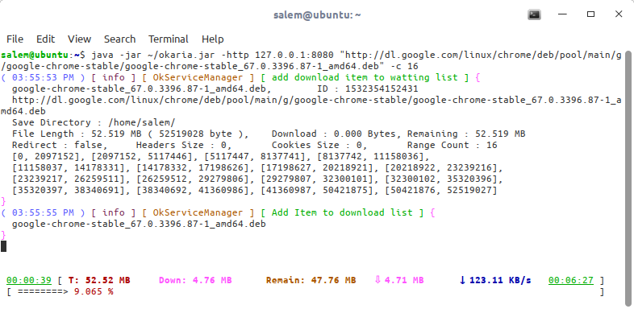

# okaria  (0.2.04)

OKaria is a smart command line download manager.


## Dependency
 - okhttp (3.10.0)
 - gson (2.8.4)
 - ansi (0.1.95)
 - jansi (1.17.1)
 - log (0.2.53)

### Options :
 - Support HTTP and HTTPS.
 - Good Handle for Header and Cookies
 - Cross-Platform: support linux/unix, windows and, mac-os.
 - Parallel Download.
 - Saved setting every 1 second.
 - Support Google Chrome with extension.
 - Support using Proxy [HTTP, HTTPS, SOCKS], COMMING SOON JSCH(SSH)
 - support download from maven repository
 - supported arguments
 
 ```
 java -jar okaria.jar URL
	-u		--url			[-u] add new link/url to download manager 
	-i		--input-file		downoload from text file - list of urls
	-m		--metalink		downoload from  metalink text/xml file - list of urls on deffrient servers for the same daownloadable file
	-r		--http-referer		set referer header for that link
	-ua		--user-agent		set user-agent header while download
	-H		--header		set one/multiable different header(s) for that link
	-C		--cookie		add cookie(s) while download
	-cf		--cookie-file		add cookie(s) from standered cookie file
	-o		--file-name		save download link to file on hard-disk
	-sp		--save-path		set directory of download process
	-t		--tries			number of tries when failler, then giveup (0 for keep-try )
	-c		--max-connection	max connection for current session for each link
	-n		--num-downloa		number of download links in queue, if more links, will be in watting list
	-p		--proxy			set proxy to http://host:port[8080]/, support protocols http, https ans socks4/5
	-http	--http-proxy		use http proxy [host:port] format
	-https	--https-proxy		use https proxy [host:port] format
	-socks	--socks-proxy		use socks proxy [host:port] format
	-socks4	--socks4-proxy		use socks4 proxy [host:port] format
	-socks5	--socks5-proxy		use socks5 proxy [host:port] format
	-s		--ssh			use ssh connection as proxy - [remotehost:port], not supported yet
	-su		--ssh-user		set ssh user name - remote login user name
	-sp		--ssh-pass		set remote login password, if non will be asked from terminal
	-gd		--google-drive-id	download from google drive servers, fileID or full URL
	-mvn	--maven			download from  maven repository, (dafault http://central.maven.org/maven2/)
	-mvng	--maven-groupId		set maven groupId
	-mvna	--maven-artifactId	set maven artifactId
	-mvnv	--maven-version		set maven version
	-mvnr	--maven-repository	download to directory default set to system maven parh in user directory
	-h		--help			print this message
	-d		--debug-level		display logging, Levels: [off, error, debug, warning, info, fine, finer, finest, all]
	-v		--version		display the version of okaria
 ```

### TO:DO:LIST

 - resolve system heat problem by caching data in memory as chunks then flush them at complete time
 - add SSH implemntaion

### Overview




### Text Link Format: 


