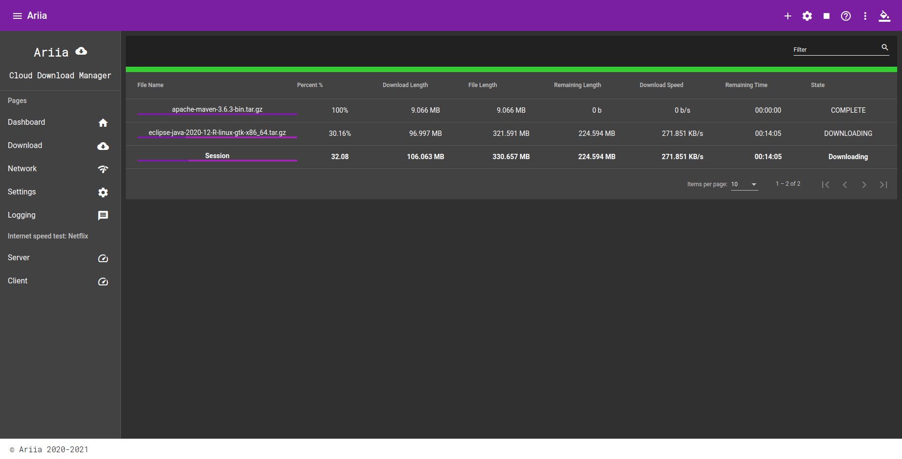

# ariia  (2.1.1)

Ariia is a command line download manager and HTML UI interface Angular 11, Aurora 0.8.6 and Java 17.



## Dependency

| Lib Name             | Version  | Info           |
|----------------------|----------|----------------|
| Gson                 | `2.10.1` |                |
| Network Speed        | `0.2.8`  |                |
| Network Connectivity | `0.2.8`  |                |
| RESTful API          | `0.2.8`  |                |
| Lawnha               | `0.2.1`  |                |
| JANSI                | `1.8`    | for Windows VM |

## Modules

- Network
- Logger
- Models
- Utils
- Network Monitor
- Core API
- Verify Data
- CLI API
- Ariia JDK 17
- Restful API
- Web Server
- Angular SPA
- Aurora SPA
- JavaFX Desktop Client


___

### JavaFX UI ():

- reuse of Ariafx (Download Manager).


___

### Options :

- support HTTP and HTTPS.
- support Header and Cookies
- cross-Platform: add support for Linux, Unix, Windows and MacOS.
- parallel download, using segment.
- saved setting every 1 second.
- support Google Chrome with extension.
- support using Proxy [HTTP, HTTPS, SOCKS], COMING SOON JSCH(SSH)
- support download from maven repository
- supported arguments
- save time while downloading, by spiriting download process and writing data to hard disk.
- using cache memory, to reduce hate resulted by continuous writhing to (mechanical/old/magnet hard disk),
  not test on ssd Hard Disk
- solve the heat problem by reducing write time to hard disk - flush on fixed rate of time every 5s.

___ 

 ```
 java - jar ariia.jar [-u] URL
	-u	--url			[-u] add new link/url to download manager
	-i	--input-file		download from text file - list of urls
	-m	--metalink		download from  metal ink text/xml file - list of urls on deficient servers for the same downloadable file
	-r	--http-referer		set referer header for that link
	-ua	--user-agent		set user-agent header while download
	-H	--header		set one/more different header(s) for that link
			add cookie(s) while download
	-cf	--cookie-file		add cookie(s) from standard cookie file
	-o	--file-name		save download link to file on hard-disk
	-sp	--save-path		set directory of download process
	-t	--tries			number of tries on failed state, then give-up (0 for keep-try forever)
	-c	--max-connection	max connection for current session for each link
	-n	--num-download		number of download links in queue, if more links, will be in waiting list
	-k	--insecure		TLS By default, every secure connection ariia makes
			is verified to be secure before the transfer takes place.
			This option makes curl skip the verification step and proceed without checking
	-p	--proxy			set proxy to http://host:port[8080]/, support protocols http, https ans socks4/5
	-http	--http-proxy		use http proxy [host:port] format
	-https	--https-proxy		use https proxy [host:port] format
	-socks	--socks-proxy		use socks proxy [host:port] format
	-socks4	--socks4-proxy		use socks4 proxy [host:port] format
	-socks5	--socks5-proxy		use socks5 proxy [host:port] format
	-pu	--proxy-user		    Specify the username for authentication on a proxy server
	-pp	--proxy-password		Specify the password for authentication on a proxy server
	-s	--ssh			use ssh connection as proxy - [remotehost:port], not supported yet
	-su	--ssh-user		set ssh user name - remote login user name
	-sp	--ssh-pass		set remote login password, if non will be asked from terminal
	-ch	--check-file		check donload file if is complete, and try to complete it
	-cs	--chunk-size		length of chunk/segment to check
	-dp	--download-pieces	index of pieces which need download. it could be in format of string as "2 52 22 783 " or a file holding the index separated by '\n'
	-st	--stream		stream URL One download connection
	-ds	--daemon-service	start ariia as daemon service
	-port	--server-port		run web application on port (default port 8080)
	-host	--server-host		run web application for local interface (default is any all)
	-rl	--resource-location	run web application with resource location directory path
	-h	--help			print this message
	-d	--debug-level		display logging, Levels: [off, log, error, warn, info, assertion, debug, trace, all]
	-v	--version		display the version of ariia


 ```

### TO:DO:LIST

- add SSH implementation

### Overview


___

___

___

___


### Text Link Format:


___

